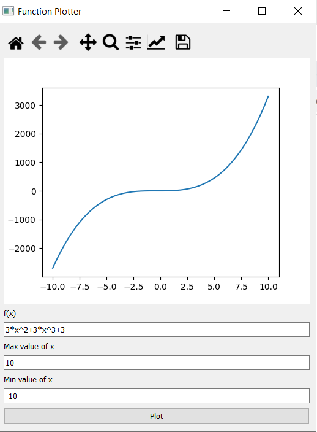
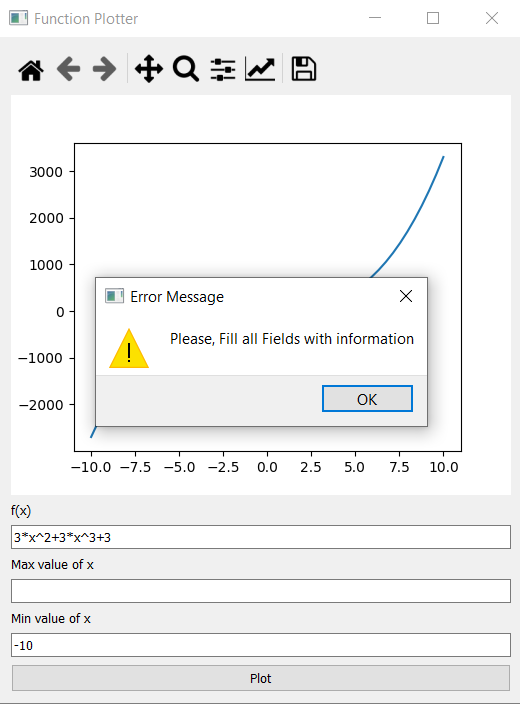
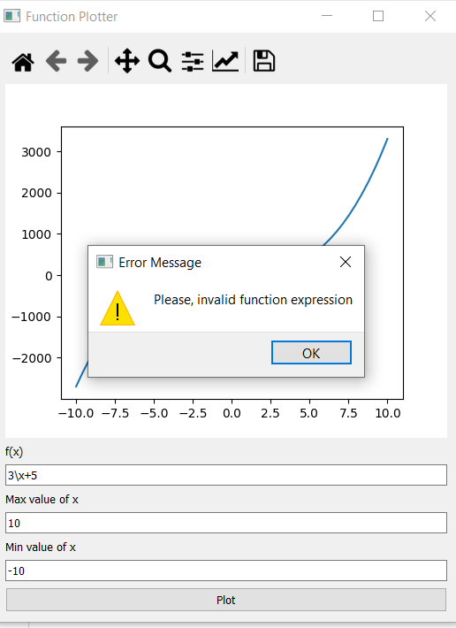

# Function-Plotter
##  📗 :green_book: Description
Function-Plotter is a GUI Python application, it hepls you to plot any function with maximum and minimum limits for the value of x 

##  :computer: Installation of the requirements:

```shell
pip install PySide2
pip install pytest
```
##  To run the application

```shell
python main.py
```
##  To run the test
```shell
pytest test.py
```
## :camera: SCREEN SHOOTS
<h1 align= "center">
 






</h1>


